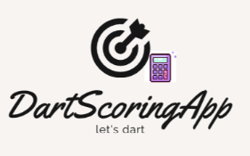

= Dart Scoring App 

Erik Seifried - v1.0, 2022-10-21 <e.seifried@students.htl-leonding.ac.at> | Systemplanung und Projektentwicklung

== Contacts: 
* Manager: <e.seifried@students.htl-leonding.ac.at> +
* Co-Manager: <l.cvijic@students.htl-leonding.ac.at> +
* Member: <a.nikolaus@students.htl-leonding.ac.at> +
* Member: <a.Cjomany@students.htl-leonding.ac.at> +

== Project assignment

|===
|Project assignment - Erik Seifried 3BHIF 03.10.2022

|*Project name:* +
DartScoringApp

|*Project client:* +
School: HTL Leonding <https://www.htl-leonding.at/> +
Contact: Thomas Stütz +
Contact details: <t.stütz@htl-leonding.ac.at>

|*Project background:* +
Since it is tedious for many dart players to always have to count while throwing, +
we decided to come up with the idea of Dart Scoring App. +
The calculation process of the players should thus be avoided.

|*Final project result:* +
A scoring app is made available to the dart player to help with the calculations

|*Project goal:* +
The aim is that the players no longer have to calculate for themselves

|*Project description / main project tasks* +
Finding a suitable logo +
Creating a model +
Determining the design (colour, etc.) +
Determining the allocation of tasks +
Implementing the home menu +
Implementing the created players +
Implementing the scoring area +
Implementing the final result after the match

|*Project start:* +
17-10-2022

|*Project end:* +
End of the school year

|*Project resources* +
Each person participating in the project has a laptop +
and the necessary tools to create this app.

|*Persons Quantity Estimate:* +
4

|*Milestones:* +
Finding a suitable logo - Erik - 15.10.2022 +
Creating a model-v1 - Erik - 15.10.2022 +
Determining the design-v1 - Erik - 15.10.2022 +
Allocation of tasks - Luka - 30.10.2022 +
Implementing the home-menu-v1 - Erik - xx.01.2022 +
Implementing the create-players-v1 - Alex - xx.03.2022 +
Implementing the calculator-v1 - Luka & Axel - xx.04.2023 +
Implementing the Result - Erik - xx.04.2023

|*Project organisation / Project Manager / Project Team:* +

|*Completion of the project assignment:* +
30-10-2022

|===