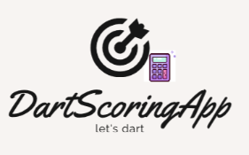

= Dart Scoring App 

== Kontakte: 
* Manager: <e.seifried@students.htl-leonding.ac.at> +
* Co-Manager: <l.cvijic@students.htl-leonding.ac.at> +
* Mitglied: <a.nikolaus@students.htl-leonding.ac.at> +
* Mitglied: <a.Csomany@students.htl-leonding.ac.at> +

== Projektauftrag

|===
|Projektauftrag - DartScoringApp

|*Projektname:* +
DartScoringApp

|*Projektkunde:* +
Schule: HTL Leonding <https://www.htl-leonding.at/> +
Kontakt: Thomas Stuetz +
Kontaktdetails: <t.stuetz@htl-leonding.ac.at>

|*Projekthintergrund:* +
Beim Dart spielen muss man die Punkte selber abziehen, was kompliziert werden kann.

|*Projektresultat:* +
Als Endprodukt steht den Benutzern die Dart Scoring App zur Verfuegung, +
die man im Browser verwenden kann.

|*Projektziel:* +
Das erleichtern des Mitzaehlens der Punkte bei einem Dartspiel.

|*Hauptprojektaufgaben* +
Passendes Logo entwerfen +
Model erstellen +
Design bestimmen (Farben, etc.) +
Zuordnung der Aufgaben +
Implementierung des Startmenues +
Implementierung der Erstellung von Spielern +
Implementierung des Rechners +
Implementierung der Resultate nach dem Spiel

|*Projektstart:* +
17-10-2022

|*Projektende:* +
Ende des Schuljahres

|*Projektresourcen* +
Jedes Mitglied hat einen Laptop und +
die benoetigten Programme um diese Applikation zu erstellen.

|*Anzahl der Personen:* +
4

|*Meilensteine:* +
Logo entwerfen - Erik - 15.10.2022 +
Model erstellen - Erik - 15.10.2022 +
Design bestimmen - Erik - 15.10.2022 +
Aufgaben zuordnung - Luka - 30.10.2022 +
Implementierung des Startmenues - Erik - xx.01.2023 +
Implementierung der Erstellung von Spielern - Alex - xx.03.2023 +
Implementierung des Rechners - Luka & Axel - xx.04.2023 +
Implementierung der Resultate nach dem Spiel - Erik & Alex - xx.04.2023

|*Projektteam:* +
Manager: Erik Seifried +
Co-Manager: Luka Cvijis +
Mitglied: Alexander Nikolaus +
Mitglied: Axel Csomany

|*Fertigstellung des Projektauftrages:* +
30-10-2022

|===