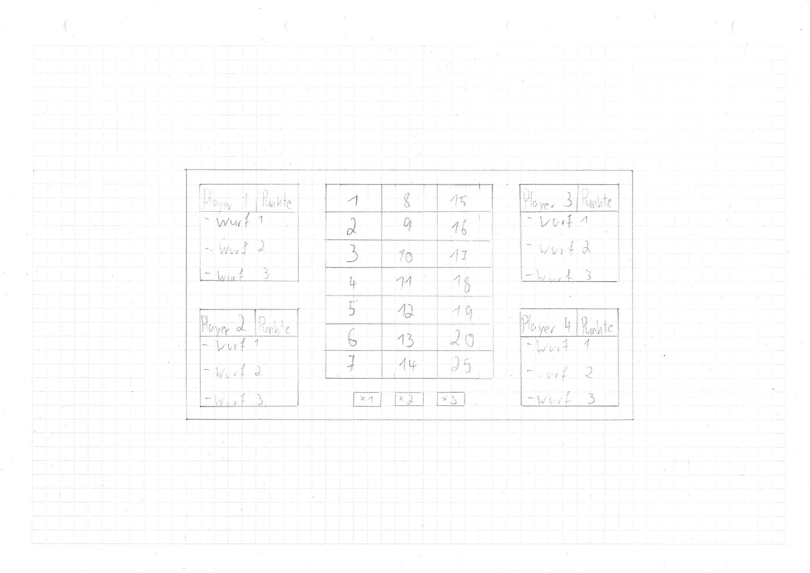

= Pflichtenheft Dart-Scoring-App

== 1 Ausgangsituation
Dart ist ein Spiel welches weltweit verbreitet ist.

== 2 Istzustand
Viele Spieler spielen mit Dartscheiben, welche nicht
automatisch die Punkte abziehen und ziehen diese dann haendisch ab.

image::img/punkteabziehen.jpg[]

== 3 Problemstellung
Beim Dart spielen muessen die Spieler selbst die geworfenen
Punkte von ihrem momentan Punktestand abziehen, dabei koennen
bei komplizierten Rechnungen fehler entstehen.

== 4 Sollzustand
Die Spieler sollen in einer App die geworfenen Punkte eingeben koennen
und diese werden dann automatisch abgezogen. Das Ergebnis dieses
Projekts ist die fertige Dart-Scoring-App.

=== 4.1 Funktionale Anforderungen

==== DOM
[plantuml, target=diagram-classes, format=png]
....
left to right direction

class GameType{
    gameType: String
}

class Player{
    name: String
    id: Integer
    points: Integer
}

class Game{
    amountPlayer: int
    pointsScored: Integer
    currentPlayer: Integer
}

Player "*"--"1" Game : plays a >
Game "*"--"1" GameType : has a >

....

In der Player-Klasse is der Name, die ID und der momentane Punktestand des Spielers
gespeichert und je nach dem welchen GameType das Game hat starten die Punkte der Spieler
entweder bei 501 oder 301.

Die Game-Klasse hat eine Variable in welcher die ID des momentanden Spielers steht nach
3 eingaben wird diese Variable erhoeht bis sie so hoch ist wie die amountPlayer-Variable
denn dann wird sie zurueckgesetz und beginnt wieder vom ersten Spieler zu zaehlen an.

In der Variable pointsScored werden die geworfenen Punkte gespeichert und dann mithilfe
von currentPlayer von der Punkteanzahl des richtigen Spielers abgezogen.

==== Wireframe

Spieloberflaeche wo die Benutzer die getroffenen Punkte eintragen koennen,
es werden waehrend des Spieles die Punktestaende und die letzten 3
Wuerfe (1 Runde) der Spieler angezeigt.

=== UCD
[plantuml, target=Use-Case-Diagramm, format=png]
....
left to right direction

actor "Player" as pl

rectangle Dart-Scoring-App {
    usecase "Create Game" as cg
    usecase "Input Points" as ip
    usecase "Choose GameType" as cgt
    usecase "Choose Player Amount" as cpa

    pl -- cg
    pl -- ip
    cgt .> cg : extends
    cpa .> cg : extends
}
....

=== 4.2 Nichtfunktionale Anforderungen
* Benutzbarkeit
** Leicht zu bedienen
* Zuverlaessigkeit
** Keine Fehler bei den Rechnungen, außer bei falscher Eingabe
* Uebertragbarkeit
** Auf allen Geraeten mit Browser nutzbar
* Wartbarkeit
** Es koennen leicht neue Spielmodi hinzugefuegt werden

== 5 Ziele
Die Spieler muessen nicht mehr im Kopf rechnen und koennen sich
auf das Spiel konzentrieren, da keine Rechenfehler mehr
entstehen werden.

== 6 Mengengerüst
* Nutzer
** 1 bis 4 gleichzeitig