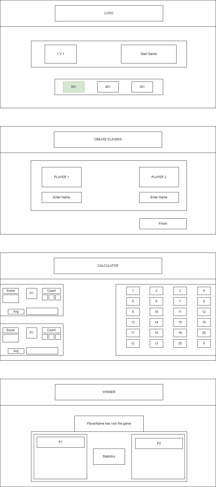

[cols="1,1"]
|===
|Phase|Beschreibung

|Ausgangssituation
|Dart ist ein Spiel welches weltweit verbreitet ist.

|Istzustand
|Viele Spieler spielen mit Dartscheiben, welche nicht
 automatisch die Punkte abziehen.

|Problemstellung
|Beim Dart spielen muessen die Spieler selbst die geworfenen
 Punkte von ihrem momentan Punktestand abziehen, dabei koennen
 bei komplizierten Rechnungen fehler entstehen.

|Sollzustand
|Die Spieler sollen in einer App die geworfenen Punkte eingeben koennen
 und diese werden dann automatisch abgezogen.

|Ziel
|Die Spieler muessen nicht mehr im Kopf rechne und können sich
 auf das Spiel konzentrieren, da keine Rechenfehler mehr
 entstehen werden.
|===

== Skizze zur Dart-Scoring-App

