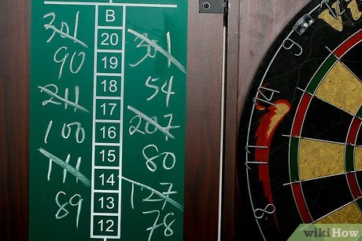
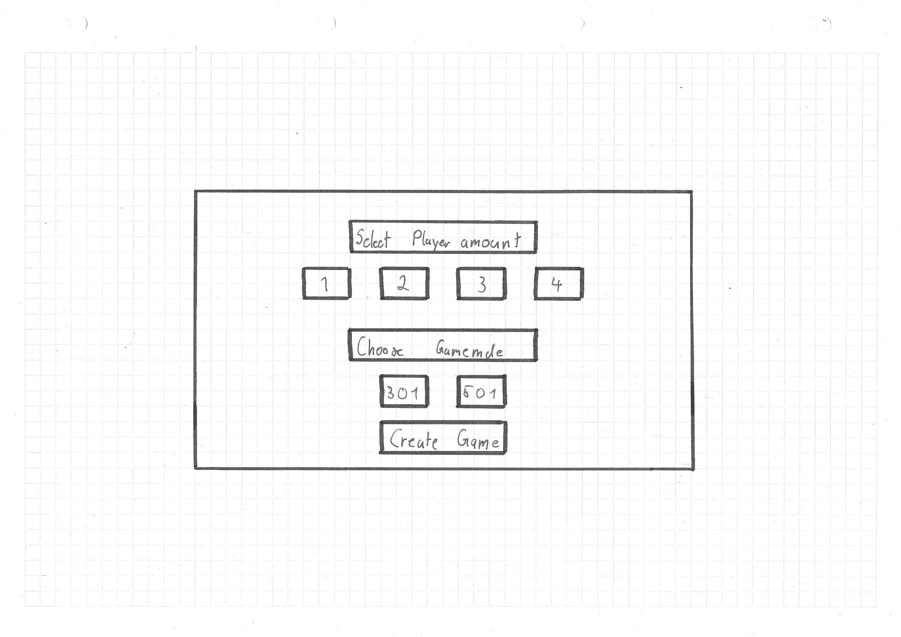
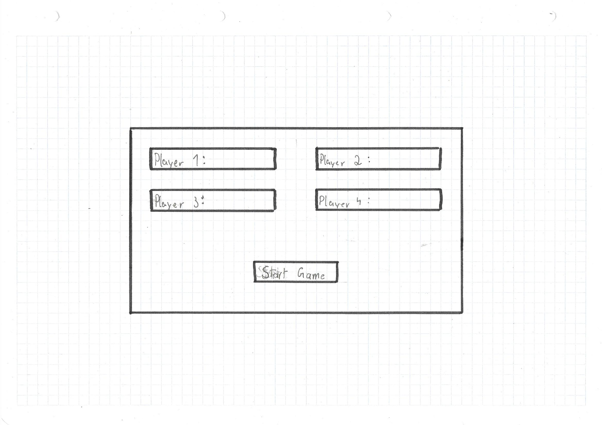
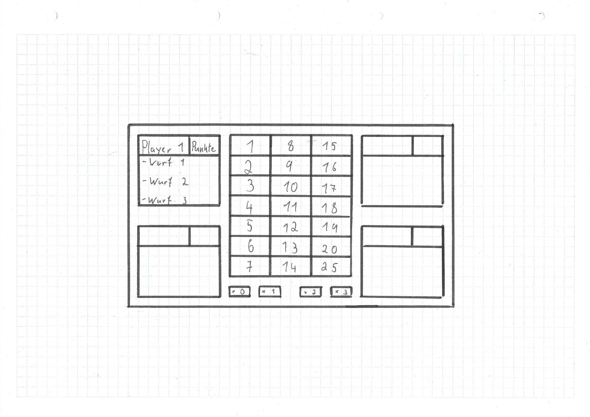
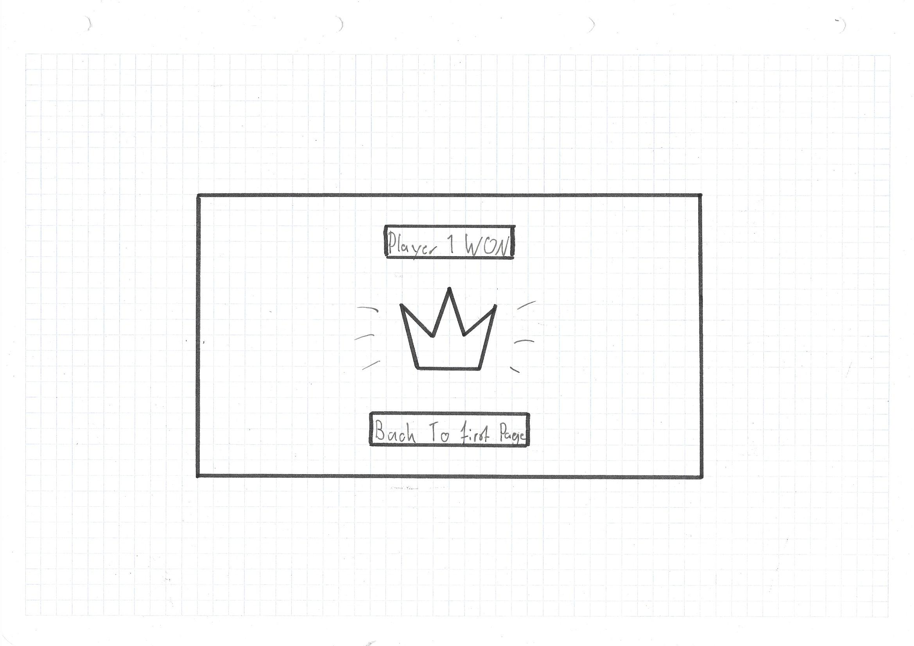

= Pflichtenheft Dart-Scoring-App

== 1 Ausgangsituation
Dart ist ein Spiel welches weltweit verbreitet ist.

== 2 Istzustand
Viele Spieler spielen mit Dartscheiben, welche nicht
automatisch die Punkte abziehen und ziehen diese dann haendisch ab.

== 3 Problemstellung
Beim Dart spielen muessen die Spieler selbst die geworfenen
Punkte von ihrem momentan Punktestand abziehen, dabei koennen
bei komplizierten Rechnungen fehler entstehen.

== 4 Sollzustand
Die Spieler sollen in einer App die geworfenen Punkte eingeben koennen
und diese werden dann automatisch abgezogen. Das Ergebnis dieses
Projekts ist die fertige Dart-Scoring-App.

=== 4.1 Funktionale Anforderungen

==== DOM
[plantuml, target=diagram-classes, format=png]
....
left to right direction

class GameType{
* gameTypeID: Integer
--
}

class Player{
* playerID: Integer
--
* name: String
}

class Game{
* gameID: Integer
--
* gameType: Integer
* currentPlayer: Integer
}

class GamePosition{
* playerID: Integer
--
* gameID: Integer
--
* points: Integer
}

Player "*"--"1" GamePosition : is in >
GamePosition "1"--"*" Game : is in <
Game "*"--"1" GameType : has a 

....

In der Player-Klasse is der Name, die ID des Spielers gespeichert.

In der GamePosition-Klasse speichert man welcher Spieler bei welchem Spiel mitspielt und auch die Punke
des jeweiligen Spieles.

Die Game-Klasse hat eine ID mit welcher die Klasse nach den Spielern in der GamePosition suchen kann, die
Punkte werden dann dem gameType (501 oder 301) gleichgesetzt. Weiters ist die ID des derzeitigen Spielers
gespeichert damit man der Reihe nach durch die List gehen kann.

Die GameType-Klasse hat eine GameTypeID (501 oder 301) die dann in der Game-Klasse gespeichert wird.

==== Wireframe

Auf der ersten Seite kann man die Anzahl der Spieler und und den Gamemodus
auswaehlen.

Auf der zweiten Seite kann der Spieler dann auch seinen Namen eingeben.
Das Layout aendert sich je nach dem wie viele Spieler mitspielen.

* 3 Spieler: Nur das Feld mit dem 4ten Spieler verschwindet
* 2 Spieler: Das Feld mit dem 3ten und 4ten Spieler verschwinden und die
    oberen 2 rutschen ein wenig nach unten
* 1 Spieler: Alle anderen Felder verschwinden und das uebrige Feld wir mittig
    positioniert

Spieloberflaeche wo die Benutzer die getroffenen Punkte eintragen koennen,
es werden waehrend des Spieles die Punktestaende und die letzten 3
Wuerfe (1 Runde) der Spieler angezeigt.

Bei weniger Spielern bleibt das Konzept des Layouts gleich wie oben erwaehnt,
nur dass wenn nur eine Person spielt dies nun links angezeigt wird und nicht zentral.

Am Ende des Spieles wird der Name des Gewinners oben angezeigt und darunter
erscheint eine Krone und ein Knopf um zuruck auf die erste Seite zu kommen
und ein neues Spiel anfangen zu koennen.

=== UCD
[plantuml, target=Use-Case-Diagramm, format=png]
....
left to right direction

actor "Player" as pl

rectangle Dart-Scoring-App {
    usecase "Create Game" as cg
    usecase "Input Points" as ip
    usecase "Choose GameType" as cgt
    usecase "Choose Player Amount" as cpa

    pl -- cg
    pl -- ip
    cg .> cgt : include
    cg .> cpa : include
}
....

=== 4.2 Nichtfunktionale Anforderungen
* Benutzbarkeit
** Leicht zu bedienen
* Zuverlaessigkeit
** Keine Fehler bei den Rechnungen, außer bei falscher Eingabe
* Uebertragbarkeit
** Auf allen Geraeten mit Browser nutzbar
* Wartbarkeit
** Es koennen leicht neue Spielmodi hinzugefuegt werden

== 5 Ziele
Die Spieler muessen nicht mehr im Kopf rechnen und koennen sich
auf das Spiel konzentrieren, da keine Rechenfehler mehr
entstehen werden.

== 6 Mengengerüst
* Nutzer
** 1 bis 4 gleichzeitig